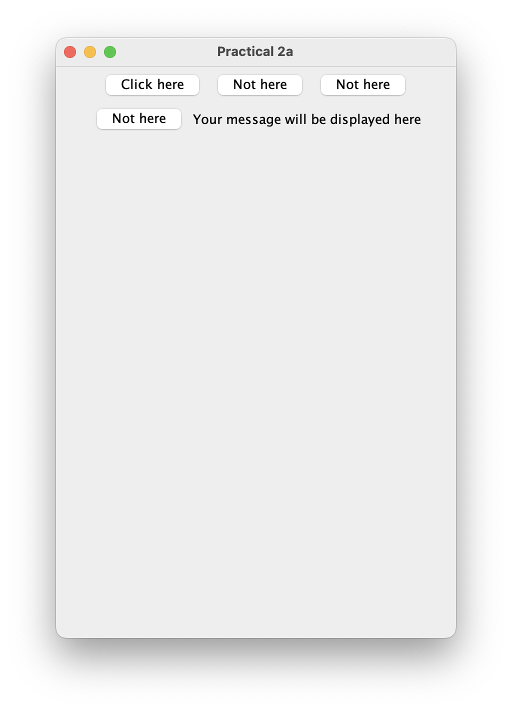
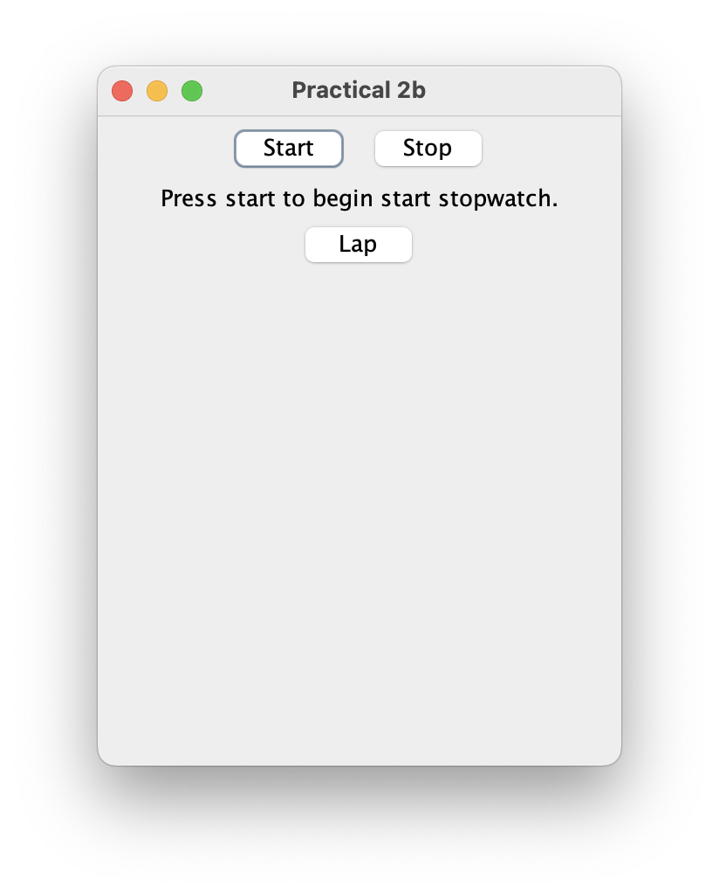

# AJ Practical 2

Date: **23-02-2023**

Roll no.: **20BCE119**

Name: **Kartavya Patel**

Course Code and Name: 2CSDE60 **Advanced Java**

## Task

-   2A) Create a swing program that displays a window containing four buttons and a label. The first button says “Click here”, and the other three buttons say “Not here”. If one of the “Not here” buttons is clicked, the label displays the message “Wrong, try again”. If the “click here” button is clicked, then the label displays “Good job. Do it again”. Also, each time the “Click here” button is clicked, a new button is randomly chosen and given the text “Click here” and the other three buttons are given the text “Not here”. The application quits when user clicks 10 times “Click here” button.
-   2B) Create a swing application for stopwatch. That contains one push button and one label. Push button is used to start and stop the stopwatch. The label displays the elapsed time.

## Practical 2A

```java
package lab.prac2;

import java.awt.*;
import java.awt.event.*;
import javax.swing.*;
import java.util.*;

class GUI_p2a extends JFrame {
    JButton[] buttons;
    JLabel l;
    int closeCount;

    GUI_p2a() {
        setVisible(true);
        setDefaultCloseOperation(3);
        setSize(400, 600);
        setLocationRelativeTo(null);
        setLayout(new FlowLayout());
        setTitle("Practical 2a");

        closeCount = 0;
        Random rand = new Random();

        buttons = new JButton[4];
        buttons[0] = new JButton("Click here");
        for (int i = 0; i < 3; i++) {
            buttons[i + 1] = new JButton("Not here");
        }

        l = new JLabel();

        l.setText("Your message will be displayed here");

        for (int i = 0; i < 4; i++) {
            add(buttons[i]);
        }
        add(l);

        buttons[0].addActionListener(new ActionListener() {
            public void actionPerformed(ActionEvent ae) {
                if (buttons[0].getText().equals("Click here")) {
                    closeCount++;
                    if (closeCount == 10) {
                        System.exit(0);
                    }
                    l.setText("Good job. Do it again");
                    int random = Math.abs(rand.nextInt()) % 4;
                    buttons[0].setText("Not here");
                    buttons[random].setText("Click here");
                } else {
                    l.setText("Wrong, try again");
                }

            }
        });

        buttons[1].addActionListener(new ActionListener() {
            public void actionPerformed(ActionEvent ae) {
                if (buttons[1].getText().equals("Click here")) {
                    closeCount++;
                    if (closeCount == 10) {
                        System.exit(0);
                    }
                    l.setText("Good job. Do it again");
                    int random = Math.abs(rand.nextInt()) % 4;
                    buttons[1].setText("Not here");
                    buttons[random].setText("Click here");
                } else {
                    l.setText("Wrong, try again");
                }

            }
        });

        buttons[2].addActionListener(new ActionListener() {
            public void actionPerformed(ActionEvent ae) {
                if (buttons[2].getText().equals("Click here")) {
                    closeCount++;
                    if (closeCount == 10) {
                        System.exit(0);
                    }
                    l.setText("Good job. Do it again");
                    int random = Math.abs(rand.nextInt()) % 4;
                    buttons[2].setText("Not here");
                    buttons[random].setText("Click here");
                } else {
                    l.setText("Wrong, try again");
                }

            }
        });

        buttons[3].addActionListener(new ActionListener() {
            public void actionPerformed(ActionEvent ae) {
                if (buttons[3].getText().equals("Click here")) {
                    closeCount++;
                    if (closeCount == 10) {
                        System.exit(0);
                    }
                    l.setText("Good job. Do it again");
                    int random = Math.abs(rand.nextInt()) % 4;
                    buttons[3].setText("Not here");
                    buttons[random].setText("Click here");
                } else {
                    l.setText("Wrong, try again");
                }

            }
        });

    }
}

public class prac2a {
    public static void main(String[] args) {
        new GUI_p2a();
    }
}
```

## 2A output



## Practical 2B

```java
package lab.prac2;

import java.awt.*;
import javax.swing.*;
import java.awt.event.*;
import java.util.Calendar;

class GUI_p2b extends JFrame implements ActionListener {

    JLabel j;
    JButton lapButton;
    JLabel lapLabel;
    long start;
    int lapCount = 1;

    public GUI_p2b() {
        setTitle("Practical 2b");
        setLocationRelativeTo(null);
        setSize(300, 400);
        setLayout(new FlowLayout());
        setDefaultCloseOperation(JFrame.EXIT_ON_CLOSE);

        JButton startButton = new JButton("Start");
        JButton stopButton = new JButton("Stop");

        startButton.addActionListener(this);
        stopButton.addActionListener(this);

        j = new JLabel("Press start to begin start stopwatch.");
        add(startButton);
        add(stopButton);
        add(j);

        lapButton = new JButton("Lap");
        add(lapButton);
        lapButton.addActionListener(this);

        setVisible(true);
    }

    @Override
    public void actionPerformed(ActionEvent e) {
        Calendar cal = Calendar.getInstance();

        if (e.getActionCommand().equals("Start")) {
            start = cal.getTimeInMillis();
            j.setText("     Stopwatch is running....     ");

        } else if (e.getActionCommand().equals("Lap")) {
            long time = (cal.getTimeInMillis() - start) / 1000;
            long seconds = time % 60;
            long minute = time / 60;
            long hour = minute / 60;

            JLabel temp = (new JLabel(("      Lap " + lapCount + "   :   " + String.format("%02d", hour) + ":"
                    + String.format("%02d", minute) + ":" + String.format("%02d", seconds) + "     ")));
            lapCount++;
            add(temp);
        } else if (e.getActionCommand().equals("Stop")) {
            long time = (cal.getTimeInMillis() - start) / 1000;
            long seconds = time % 60;
            long minute = time / 60;
            long hour = minute / 60;
            j.setText("     Elapsed time is " + String.format("%02d", hour) + ":" + String.format("%02d", minute) + ":"
                    + String.format("%02d", seconds) + "     ");

        }
    }

}

public class prac2b {

    public static void main(String args[]) {
        new GUI_p2b();
    }
}
```

## 2B output


