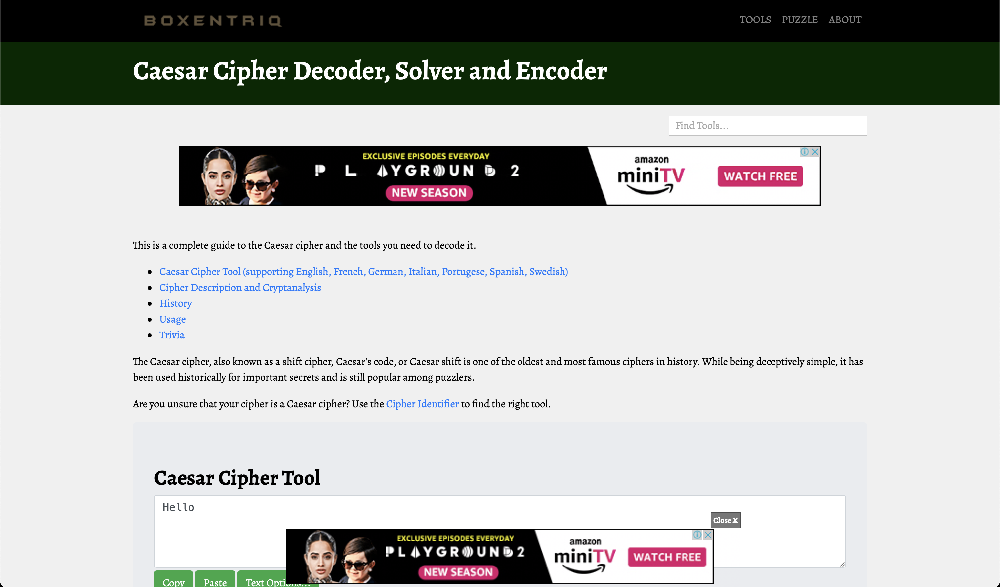

# INS Practical 3

Date: **27-02-2023**

Roll no.: **20BCE119**

Name: **Kartavya Patel**

Course Code and Name: 2CSDE54 **Information and Network Security**

# Task

-   Exploration of various tools to perform encryption and decryption

# Caesar cipher tools

Link: [https://www.boxentriq.com/code-breaking/caesar-cipher](https://www.boxentriq.com/code-breaking/caesar-cipher)

Link: [https://www.xarg.org/tools/caesar-cipher/](https://www.xarg.org/tools/caesar-cipher/)

Link: [https://cryptii.com/pipes/caesar-cipher](https://cryptii.com/pipes/caesar-cipher)

Link: [https://md5decrypt.net/en/Caesar/](https://md5decrypt.net/en/Caesar/)

Link: [https://www.thewordfinder.com/caesar-cipher-solver/](https://www.thewordfinder.com/caesar-cipher-solver/)

# Transposition cipher tools

Link: [https://www.boxentriq.com/code-breaking/columnar-transposition-cipher](https://www.boxentriq.com/code-breaking/columnar-transposition-cipher)

Link: [https://tholman.com/other/transposition/](https://tholman.com/other/transposition/)

Link: [https://www.cryptool.org/en/cto/transposition](https://www.cryptool.org/en/cto/transposition)

Link: [https://asecuritysite.com/encryption/col](https://asecuritysite.com/encryption/col)

Link: [https://crypto.interactive-maths.com/columnar-transposition-cipher.html](https://crypto.interactive-maths.com/columnar-transposition-cipher.html)

