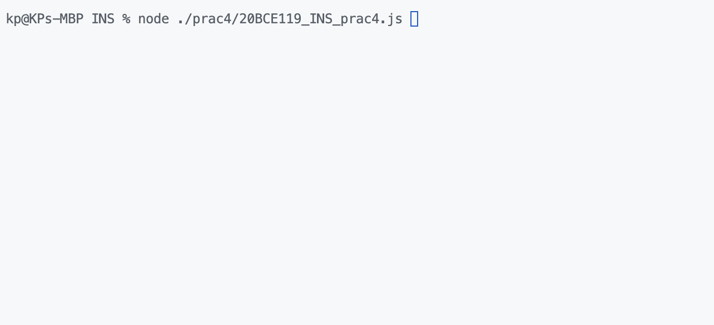
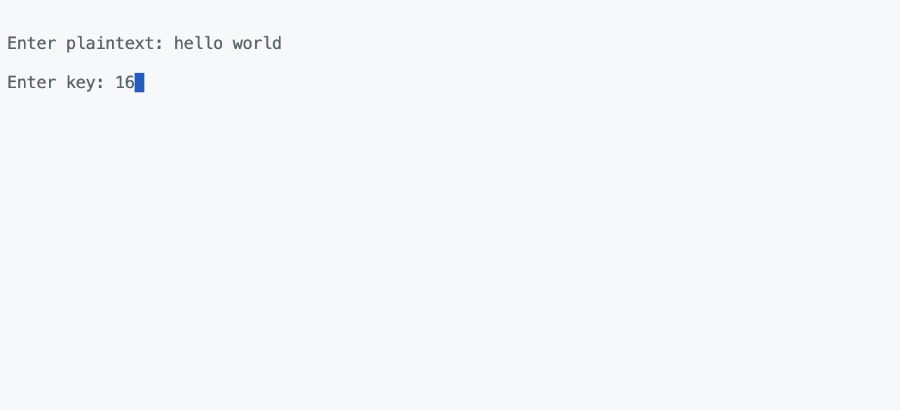
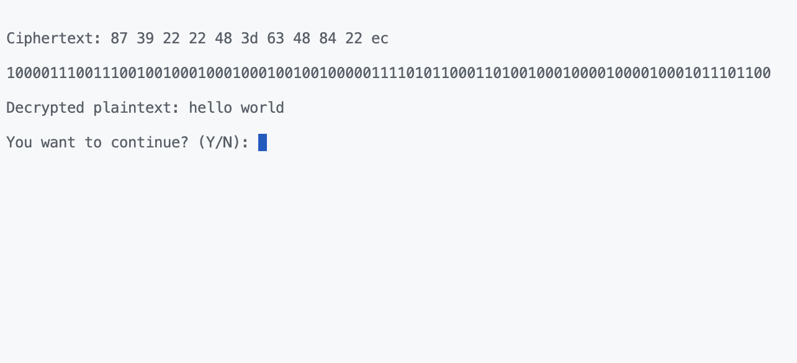

# INS Practical 4

Date: **27-02-2023**

Roll no.: **20BCE119**

Name: **Kartavya Patel**

Course Code and Name: 2CSDE54 **Information and Network Security**

# Task

-   Cryptography-implementation using block-cipher DES

# Code

```js
"use strict";

var readline = require("readline");

function get_binary(value, min_size) {
    let binary_rep = value.toString(2).split("").reverse();
    while (binary_rep.length < min_size) binary_rep.push("0");
    return binary_rep.reverse().join("");
}
function xor_operation(a, b) {
    return a ^ b;
}
function circular_left_shift(num, shift_amount, size_of_shift_register) {
    let binary_rep = get_binary(num, size_of_shift_register);
    shift_amount = shift_amount % size_of_shift_register;
    return parseInt(
        binary_rep.substring(shift_amount) +
            binary_rep.substring(0, shift_amount),
        2
    );
}

let plaintext_block_size = 8,
    key_size = 10,
    no_of_rounds = 2,
    subkey_initial_permutation = [3, 5, 2, 7, 4, 10, 1, 9, 8, 6],
    subkey_compression_permutation = [6, 3, 7, 4, 8, 5, 10, 9],
    plaintext_initial_permutation = [2, 6, 3, 1, 4, 8, 5, 7],
    plaintext_expansion_permutation = [4, 1, 2, 3, 2, 3, 4, 1],
    key_shift_values = [1, 2],
    substitution_box_0 = [
        [1, 0, 3, 2],
        [3, 2, 1, 0],
        [0, 2, 1, 3],
        [3, 1, 3, 2],
    ],
    substitution_box_1 = [
        [0, 1, 2, 3],
        [2, 0, 1, 3],
        [3, 0, 1, 0],
        [2, 1, 0, 3],
    ],
    right_half_permutation_box = [2, 4, 3, 1],
    inverse_initial_permutation = [4, 1, 3, 5, 7, 2, 8, 6];
function get_permuted_value(data, permutation) {
    let permuted_value = [];
    permutation.forEach((item) => {
        permuted_value.push(data[item - 1]);
    });
    return permuted_value.join("");
}
function generate_subkeys(key) {
    key = get_binary(key, key_size);
    let permuted_key = get_permuted_value(key, subkey_initial_permutation),
        all_subkeys = [],
        left_half,
        right_half;
    for (let index = 0; index < no_of_rounds; index++) {
        left_half = permuted_key.substring(0, Math.floor(key_size / 2));
        right_half = permuted_key.substring(Math.floor(key_size / 2));
        [left_half, right_half].forEach((half) => {
            half = get_binary(
                circular_left_shift(
                    parseInt(half, 2),
                    key_shift_values[index],
                    Math.floor(key_size / 2)
                ),
                Math.floor(key_size / 2)
            );
        });
        let merged_halfs = left_half + right_half;
        all_subkeys.push(
            get_permuted_value(merged_halfs, subkey_compression_permutation)
        );
        permuted_key = merged_halfs;
    }
    return all_subkeys;
}
function perform_substitution(data, sub_box) {
    let row_number = parseInt(data[0] + data[3], 2),
        column_number = parseInt(data[1] + data[2], 2);
    return get_binary(sub_box[row_number][column_number], 2);
}
function encrypt(plaintext, keys) {
    let permuted_plaintext = [],
        ciphertext = [],
        k = 0,
        i;
    plaintext.split("").forEach((character) => {
        let binary_plaintext = get_binary(
            character.charCodeAt(0),
            plaintext_block_size
        );
        permuted_plaintext.push(
            get_permuted_value(binary_plaintext, plaintext_initial_permutation)
        );
    });
    keys.forEach((key) => {
        i = 0;
        permuted_plaintext.forEach((block) => {
            let left_half = block.substring(0, 4),
                right_half = block.substring(4),
                new_left_half = right_half,
                new_right_half,
                temp;
            right_half = get_permuted_value(
                right_half,
                plaintext_expansion_permutation
            );
            temp = xor_operation(parseInt(right_half, 2), parseInt(key, 2));
            right_half = get_binary(temp, block.length);
            right_half =
                perform_substitution(
                    right_half.substring(0, 4),
                    substitution_box_0
                ) +
                perform_substitution(
                    right_half.substring(4),
                    substitution_box_1
                );
            right_half = get_permuted_value(
                right_half,
                right_half_permutation_box
            );
            temp = xor_operation(
                parseInt(right_half, 2),
                parseInt(left_half, 2)
            );
            new_right_half = get_binary(temp, Math.floor(block.length / 2));
            if (k === keys.length - 1)
                permuted_plaintext[i] = new_right_half + new_left_half;
            else permuted_plaintext[i] = new_left_half + new_right_half;
            i++;
        });
        k++;
    });
    permuted_plaintext.forEach((block) => {
        ciphertext.push(get_permuted_value(block, inverse_initial_permutation));
    });
    return ciphertext;
}
function decrypt(ciphertext, keys) {
    let ciphertext_blocks = [],
        i = 0,
        k = 0,
        plaintext = [];
    while (i < ciphertext.length) {
        ciphertext_blocks.push(
            get_permuted_value(
                ciphertext.substring(i, i + plaintext_block_size),
                plaintext_initial_permutation
            )
        );
        i += 8;
    }
    keys.forEach((key) => {
        i = 0;
        ciphertext_blocks.forEach((block) => {
            let left_half = block.substring(0, 4),
                right_half = block.substring(4),
                new_left_half = right_half,
                new_right_half,
                temp;
            right_half = get_permuted_value(
                right_half,
                plaintext_expansion_permutation
            );
            temp = xor_operation(parseInt(right_half, 2), parseInt(key, 2));
            right_half = get_binary(temp, block.length);
            right_half =
                perform_substitution(
                    right_half.substring(0, 4),
                    substitution_box_0
                ) +
                perform_substitution(
                    right_half.substring(4),
                    substitution_box_1
                );
            right_half = get_permuted_value(
                right_half,
                right_half_permutation_box
            );
            temp = xor_operation(
                parseInt(right_half, 2),
                parseInt(left_half, 2)
            );
            new_right_half = get_binary(temp, Math.floor(block.length / 2));
            if (k === keys.length - 1)
                ciphertext_blocks[i] = new_right_half + new_left_half;
            else ciphertext_blocks[i] = new_left_half + new_right_half;
            i++;
        });
        k++;
    });
    ciphertext_blocks.forEach((block) => {
        plaintext.push(
            String.fromCharCode(
                parseInt(
                    get_permuted_value(block, inverse_initial_permutation),
                    2
                )
            )
        );
    });
    return plaintext;
}

let plaintext, key;
const rl = readline.createInterface({
    input: process.stdin,
    output: process.stdout,
});
function askToContinue() {
    rl.question("\nYou want to continue? (Y/N): ", (answer) => {
        if (answer === "y" || answer === "Y") {
            askPlaintext();
        } else if (answer === "n" || answer === "N") {
            console.clear();
            rl.close();
        } else {
            console.log("\nPlease enter Y or N only.");
            askToContinue();
        }
    });
}
function askKey() {
    rl.question("\nEnter key: ", (answer) => {
        ((max_range) => {
            try {
                key = Math.floor(Number(answer));
                if (key < 0 || key > max_range || isNaN(key)) {
                    console.clear();
                    console.log(`\nKey must be from ${0} to ${max_range}`);
                    askKey();
                    return;
                }
                console.clear();
                let ciphertext_hex = [],
                    subkeys = generate_subkeys(key),
                    ciphertext = encrypt(plaintext, subkeys);
                ciphertext.forEach((item) => {
                    ciphertext_hex.push(parseInt(item, 2).toString(16));
                });
                console.log(`\nCiphertext: ${ciphertext_hex.join(" ")}`);
                ciphertext = ciphertext.join("");
                console.log(`\n${ciphertext}`);
                subkeys.reverse();
                plaintext = decrypt(ciphertext, subkeys).join("");
                console.log(`\nDecrypted plaintext: ${plaintext}`);
                askToContinue();
            } catch (error) {
                console.clear();
                console.log(`\nKey must be from ${0} to ${max_range}`);
                askKey();
            }
        })(2 ** key_size - 1);
    });
}
function askPlaintext() {
    console.clear();
    rl.question("\nEnter plaintext: ", (answer) => {
        plaintext = answer;
        askKey();
    });
}
askPlaintext();
```

# Output




