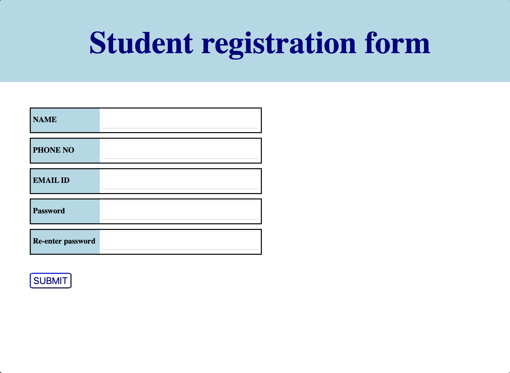

# LAMP Practical 1

Date: **31-01-2023**

Roll no.: **20BCE119**

Name: **Kartavya Patel**

Course Code and Name: 2CSDE69 **LAMP Technologies**

# Task

-   Design a personal profile web page, which contains form to enter personal, academic, co-curricular information, using basic concept of HTML, CSS and JavaScript. Also validate each field.

## HTMl and JavaScript code

```html
<!DOCTYPE html>
<html lang="en">
    <head>
        <meta charset="UTF-8" />
        <meta http-equiv="X-UA-Compatible" content="IE=edge" />
        <meta name="viewport" content="width=device-width, initial-scale=1.0" />
        <title>Form</title>
        <style>
            .heading {
                margin: 0;
                padding: 10px;
                color: navy;
                font-size: 2rem;
                height: 150px;
                width: 100%;
                background-color: lightblue;
                text-align: center;
            }

            body {
                margin: 0;
                padding: 0;
            }

            h4 {
                margin: 0%;
                padding: 0%;
            }

            .nameoffield {
                margin: 0%;
                width: 42%;
                padding: 1%;
                padding-top: 3%;
                height: 30px;
                background-color: lightblue;
            }

            .value {
                height: 30px;
                width: 100%;
                margin: 1%;
            }

            .field {
                margin: 1%;
                border: solid 2px black;
                width: 50%;
                display: flex;
            }

            .formstyle {
                margin-top: 5%;
                margin-left: 5%;
                width: 90%;
            }

            .btn {
                margin: 1%;
                margin-top: 3%;
                font-size: 1.2rem;
                border-radius: 10%;
                background-color: white;
                border-color: navy;
                color: navy;
            }

            .btn:hover {
                color: white;
                background-color: navy;
            }

            .below {
                margin: 5% 1%;
            }

            .text {
                margin: 3% 0%;
            }
        </style>
    </head>

    <body>
        <div class="heading">
            <h1>Student registration form</h1>
        </div>
        <div class="formstyle">
            <div class="field">
                <h4 class="nameoffield">NAME</h4>
                <input class="value" type="text" id="name" required />
            </div>
            <div class="field">
                <h4 class="nameoffield">PHONE NO</h4>
                <input class="value" type="text" id="phoneno" required />
            </div>
            <div class="field">
                <h4 class="nameoffield">EMAIL ID</h4>
                <input class="value" type="text" id="emailid" required />
            </div>
            <div class="field">
                <h4 class="nameoffield">Password</h4>
                <input class="value" type="password" id="password" required />
            </div>
            <div class="field">
                <h4 class="nameoffield">Re-enter password</h4>
                <input
                    class="value"
                    type="password"
                    id="reenter-password"
                    required
                />
            </div>
            <button id="submit-btn" class="btn">SUBMIT</button>
        </div>

        <script>
            const elements = {
                name: (() => {
                    return document.getElementById("name");
                })(),
                phoneno: (() => {
                    return document.getElementById("phoneno");
                })(),
                emailid: (() => {
                    return document.getElementById("emailid");
                })(),
                password: (() => {
                    return document.getElementById("password");
                })(),
                reenter_password: (() => {
                    return document.getElementById("reenter-password");
                })(),
                submit_btn: (() => {
                    return document.getElementById("submit-btn");
                })(),
            };

            function checkName() {
                const nameRegex = /^[a-zA-Z ]+$/;
                let value = elements.name.value;
                if (nameRegex.exec(value) == null) {
                    alert("Error in name input");
                    throw Error("Error in name input");
                }
            }
            function checkPhone() {
                const phoneRegex =
                    /^\s*(?:\+?(\d{1,3}))?[-. (]*(\d{3})[-. )]*(\d{3})[-. ]*(\d{4})(?: *x(\d+))?\s*$/;
                let value = elements.phoneno.value;
                if (phoneRegex.exec(value) == null) {
                    alert("Error in phone number input");
                    throw Error("Error in phone number input");
                }
            }
            function checkEmail() {
                const emailRegex =
                    /^(([^<>()[\]\\.,;:\s@"]+(\.[^<>()[\]\\.,;:\s@"]+)*)|(".+"))@((\[[0-9]{1,3}\.[0-9]{1,3}\.[0-9]{1,3}\.[0-9]{1,3}\])|(([a-zA-Z\-0-9]+\.)+[a-zA-Z]{2,}))$/;
                let value = elements.emailid.value;
                if (emailRegex.exec(value) == null) {
                    alert("Error in email input");
                    throw Error("Error in email input");
                }
            }
            function checkPassword() {
                const passwordRegex =
                    /^(?=.*[0-9])(?=.*[!@#$%^&*])[a-zA-Z0-9!@#$%^&*]{6,16}$/;
                let value = elements.password.value;
                if (passwordRegex.exec(value) == null) {
                    alert("Error in password input");
                    throw Error("Error in password input");
                }
            }
            function recheckPassword() {
                let password = elements.password.value,
                    reenter_password = elements.reenter_password.value;
                if (password != reenter_password) {
                    alert("Enter same password");
                    throw Error("Enter same password");
                }
            }
            elements.submit_btn.onclick = () => {
                checkName();
                checkPhone();
                checkEmail();
                checkPassword();
                recheckPassword();
                [
                    elements.name,
                    elements.phoneno,
                    elements.emailid,
                    elements.password,
                    elements.reenter_password,
                ].forEach((element) => {
                    element.value = "";
                });
                alert("Registered");
            };
        </script>
    </body>
</html>
```

# Output


