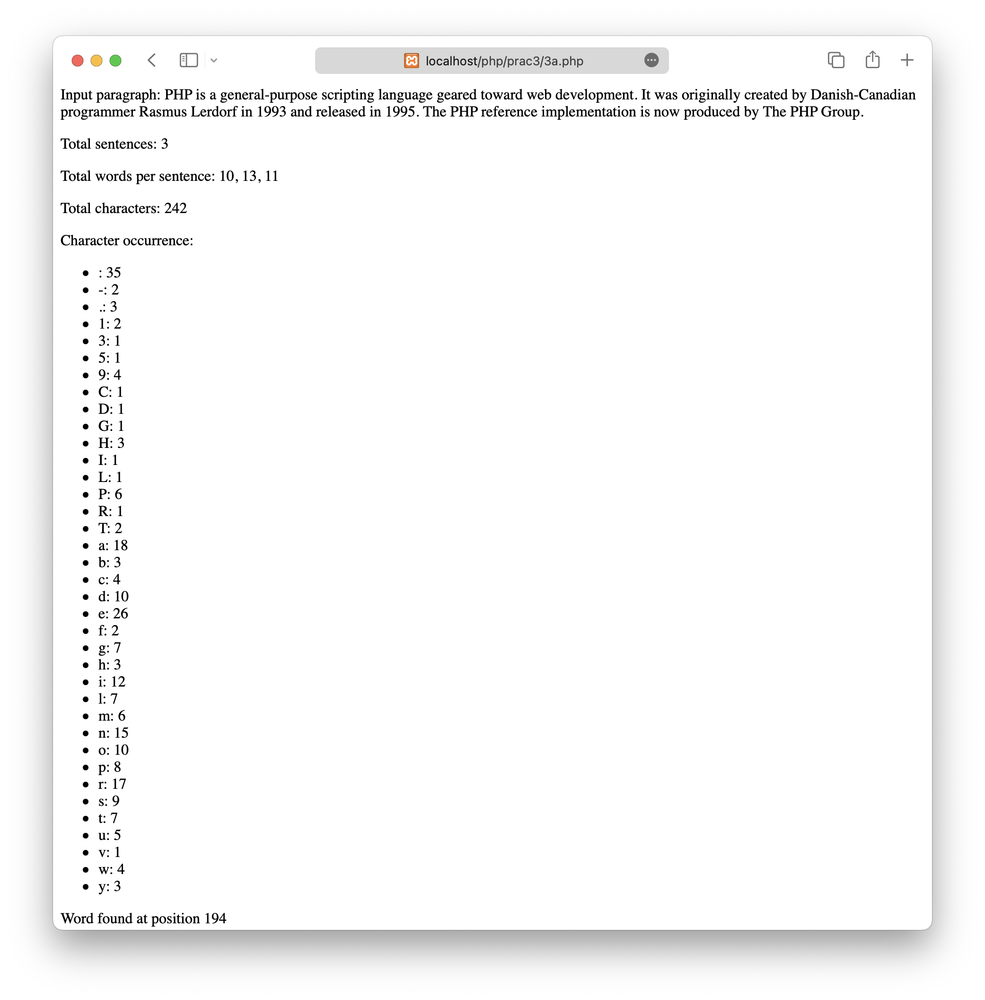
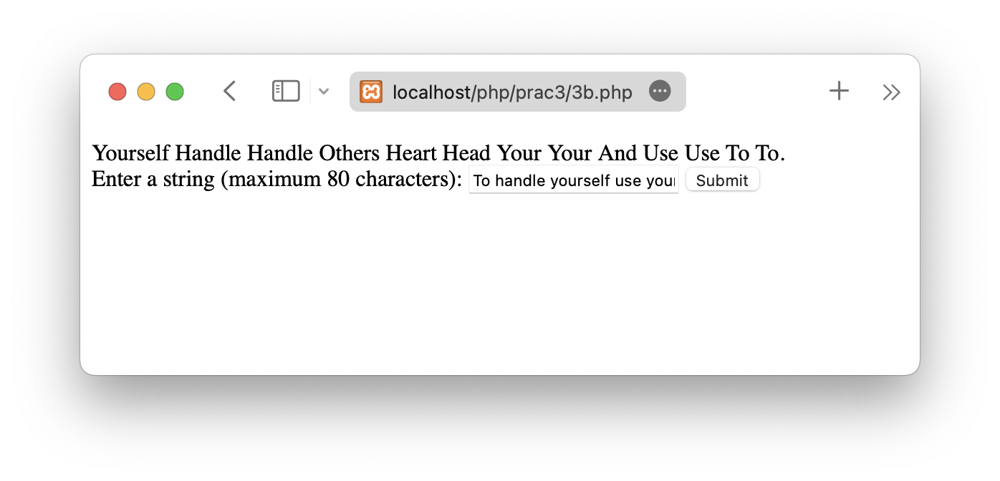

# LAMP Practical 3

Date: **14-02-2023**

Roll no.: **20BCE119**

Name: **Kartavya Patel**

Course Code and Name: 2CSDE69 **LAMP Technologies**

# Task

-   3A) Write a PHP Code which asks user to enter a paragraph and perform the following operations:

    -   Find total no of sentences in the paragraph and the total number of words in each sentence.
    -   Find the total number of characters in the entire paragraph and find out the occurrence of each character in the paragraph and display the information in proper format.
    -   Search a word (entered by the user) in the paragraph and print the position of the word (if found) or print appropriate message.

-   3B) Write a PHP Code which takes a string (maximum 80 characters) terminated by a full stop. The words in this string are assumed to be separated by one or more blanks.
    Arrange the words of the input string in descending order of their lengths. Same length words should be sorted alphabetically. Each word must start with an uppercase letter and the sentence should be terminated by a full stop.

    -   SAMPLE DATA:
        INPUT:
        "This is human resource department."

        OUTPUT:
        Department Resource Human This Is.

        INPUT:
        "To handle yourself use your head and to handle others use your heart."

        OUTPUT:
        Yourself Handle Handle Others Heart Head Your Your And Use Use To To.

## Practical 3A code

```php
<!DOCTYPE html>
<html lang="en">

<head>
    <meta charset="UTF-8">
    <meta http-equiv="X-UA-Compatible" content="IE=edge">
    <meta name="viewport" content="width=device-width, initial-scale=1.0">
    <title>Practical 3A</title>
</head>

<body>
    <?php
    // check if form is submitted
    if (isset($_POST['paragraph'])) {
        $paragraph = $_POST['paragraph'];

        echo "Input paragraph: " . $paragraph;

        // find total number of sentences and words in each sentence
        $sentences = preg_split('/(?<=[.?!])\s+/', $paragraph, -1, PREG_SPLIT_NO_EMPTY);
        $total_sentences = count($sentences);
        $total_words_per_sentence = array_map('str_word_count', $sentences);

        echo "<p>Total sentences: " . $total_sentences . "</p>";
        echo "<p>Total words per sentence: " . implode(", ", $total_words_per_sentence) . "</p>";

        // find total number of characters and occurrence of each character
        $total_characters = strlen($paragraph);
        $char_occurrence = count_chars($paragraph, 1);

        echo "<p>Total characters: " . $total_characters . "</p>";
        echo "<p>Character occurrence:</p>";

        echo "<ul>";
        foreach ($char_occurrence as $char => $count) {
            echo "<li>" . chr($char) . ": " . $count . "</li>";
        }
        echo "</ul>";

        // search a word in the paragraph and print its position
        if (isset($_POST['search_word']) && !empty($_POST['search_word'])) {
            $search_word = $_POST['search_word'];

            $word_position = strpos($paragraph, $search_word);

            if ($word_position !== false) {
                echo "<p>Word found at position " . $word_position . "</p>";
            } else {
                echo "<p>Word not found in paragraph.</p>";
            }
        } elseif (isset($_POST['search_word'])) {
            echo "<p>Search word not provided.</p>";
        }
    }
    ?>

    <form method="post">
        <label for="paragraph">Enter a paragraph:</label><br>
        <textarea id="paragraph" name="paragraph" rows="5" cols="40"></textarea><br>

        <label for="search_word">Enter a word to search:</label><br>
        <input type="text" id="search_word" name="search_word"><br>

        <input type="submit" value="Submit">
    </form>
</body>

</html>
```

## Practical 3B code

```php
<!DOCTYPE html>
<html lang="en">

<head>
    <meta charset="UTF-8">
    <meta http-equiv="X-UA-Compatible" content="IE=edge">
    <meta name="viewport" content="width=device-width, initial-scale=1.0">
    <title>Practical 3B</title>
</head>

<body>
    <?php
    // Check if the form has been submitted using the POST method
    if ($_SERVER['REQUEST_METHOD'] == 'POST') {
        // Get the input value from the form and remove any trailing periods
        $input = trim($_POST['input']);
        $input = rtrim($input, '.');
        // Check if the input string is longer than 80 characters
        if (strlen($input) > 80) {
            echo 'String length exceeds 80 characters limit';
        } else {
            // Split the input string into an array of words
            $words = explode(' ', $input);
            // Capitalize the first letter of each word and make the rest lowercase
            foreach ($words as $key => $word) {
                $words[$key] = ucfirst(strtolower($word));
            }
            // Sort the words in descending order of length, then ascending order of alphabetically, ignoring case
            uasort($words, function ($a, $b) {
                if (strlen($a) == strlen($b)) {
                    return strcasecmp($a, $b);
                }
                return strlen($b) - strlen($a);
            });
            // Join the sorted words back into a sentence and add a period at the end
            $sortedSentence = implode(' ', $words) . '.';
            // Display the sorted sentence
            echo $sortedSentence;
        }
    }
    ?>

    <form method="POST">
        <label for="input">Enter a string (maximum 80 characters):</label>
        <input type="text" id="input" name="input" maxlength="80" required>
        <button type="submit">Submit</button>
    </form>
</body>

</html>
```

## Practical 3A output



## Practical 3B output


