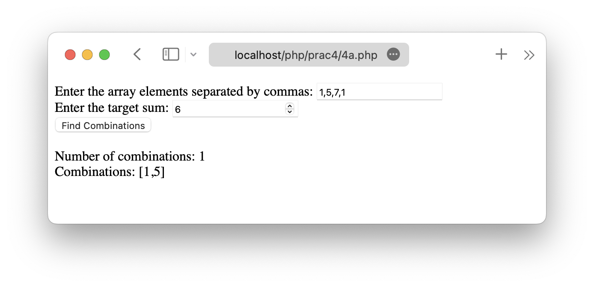
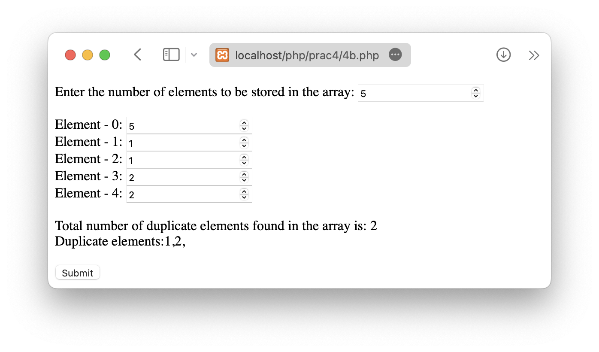

# LAMP Practical 4

Date: **28-02-2023**

Roll no.: **20BCE119**

Name: **Kartavya Patel**

Course Code and Name: 2CSDE69 **LAMP Technologies**

# Task

-   4A) Write a PHP program for the following scenario:

    -   Given an array of N integers, and an integer K, find the number of pairs of elements in the array whose sum is equal to K. The values of N, K and array elements must be scanned from the user.

        Sample example:

        Input:

        N = 4, K = 6

        arr[] = {1, 5, 7, 1}

        Output:

        Number of pairs in the array: 2

        Pairs: [1,5],[5,1]

-   4B) Write a PHP program to display and count a total number of duplicate elements in the one-dimensional array. The size of array must be scan from the user.

    Sample example:

    Input the number of elements to be stored in the array :5

    Input 5 elements in the array:

    element - 0: 5

    element - 1: 1

    element - 2: 1

    element - 3: 2

    element - 4: 2

    Expected Output:

    Total number of duplicate elements found in the array is: 2

    Duplicate elements:1,2

## Practical 4A code

```php
<!DOCTYPE html>
<html lang="en">

<head>
    <meta charset="UTF-8">
    <meta http-equiv="X-UA-Compatible" content="IE=edge">
    <meta name="viewport" content="width=device-width, initial-scale=1.0">
    <title>Practical 4A</title>
</head>

<body>
    <form method="post">
        <label for="arr">Enter the array elements separated by commas:</label>
        <input type="text" name="arr" required><br>

        <label for="K">Enter the target sum:</label>
        <input type="number" name="K" required><br>

        <input type="submit" name="submit" value="Find Combinations">
    </form>
    <br>

    <?php
    if (isset($_POST['submit'])) {
        $arr = array_map('intval', explode(",", $_POST['arr']));
        $K = $_POST['K'];

        // check for invalid input
        if (empty($arr)) {
            echo "Error: Array cannot be empty!";
        } else if (!is_numeric($K)) {
            echo "Error: Target sum must be a number!";
        } else {
            $count = 0;
            $combinations = array();

            // loop through all possible combinations of array elements
            for ($i = 0; $i < pow(2, count($arr)); $i++) {
                $subset = array();
                $sum = 0;

                for ($j = 0; $j < count($arr); $j++) {
                    if (($i & (1 << $j)) > 0) {
                        $subset[] = $arr[$j];
                        $sum += $arr[$j];
                    }
                }

                if ($sum == $K) {
                    sort($subset); // sort subset to avoid duplicate pairs

                    if (!in_array($subset, $combinations)) { // check if subset already counted
                        $count++;
                        $combinations[] = $subset;
                    }
                }
            }

            if ($count == 0) {
                echo "No combinations found.";
            } else {
                echo "Number of combinations: " . $count . "<br>";
                echo "Combinations: ";
                foreach ($combinations as $c) {
                    echo "[";
                    for ($i = 0; $i < count($c); $i++) {
                        echo $c[$i];
                        if ($i < count($c) - 1) {
                            echo ",";
                        }
                    }
                    echo "] ";
                }
            }
        }
    }
    ?>
</body>

</html>
```

## Practical 4B code

```php
<!DOCTYPE html>
<html lang="en">

<head>
    <meta charset="UTF-8">
    <meta http-equiv="X-UA-Compatible" content="IE=edge">
    <meta name="viewport" content="width=device-width, initial-scale=1.0">
    <title>Practical 4B</title>
</head>

<body>
    <form method="post">
        <label>Enter the number of elements to be stored in the array:</label>
        <input type="number" name="n"><br><br>
        <?php
        if (isset($_POST['submit'])) {
            $n = $_POST['n'];
            $arr = array();
            for ($i = 0; $i < $n; $i++) {
                echo "Element - " . $i . ": ";
                $arr[$i] = $_POST['elem' . $i];
                echo "<input type='number' name='elem" . $i . "' value='" . $arr[$i] . "'><br>";
            }
            $count = 0;
            $dupes = array();
            for ($i = 0; $i < $n; $i++) {
                for ($j = $i + 1; $j < $n; $j++) {
                    if ($arr[$i] == $arr[$j]) {
                        $dupes[$count] = $arr[$i];
                        $count++;
                        break;
                    }
                }
            }
            echo "<br>Total number of duplicate elements found in the array is: " . $count;
            echo "<br>Duplicate elements:";
            $dupes = array_unique($dupes);
            foreach ($dupes as $dupe) {
                echo $dupe . ",";
            }
        }
        ?>
        <br><br>
        <input type="submit" name="submit" value="Submit">
    </form>
</body>

</html>
```

## Practical 4A output



## Practical 4B output


